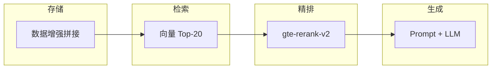

# Day10 学习日志 · 2026-03-27

> **副标题**：用 LangChain 搭一套可落地的**制度 RAG**（检索 + 生成）。

---

> **定稿说明**  
> 整合同日笔记与仓库实现，写清 **RAG 工程链路**，并单独沉淀 **同步阶段数据增强** 与 **DashScope Rerank（`gte-rerank-v2`）**。  
> 细节以 `data/课程练习/RAG技术与应用/langchain_rag.py` 为准。

---

## 一、今日主题与目标

| 维度 | 内容 |
|------|------|
| **主线** | 贯通 **RAG**：LangChain + FAISS + DashScope（Embedding / 对话 / 精排），从建库到问答 |
| **场景** | 公司 **制度 PDF**，掌握溯源元数据、增量同步、相似度过滤、CLI 与交互问答 |
| **今日加码 ①** | **数据增强**：写入向量库**之前**，把「身份」信息拼进 `page_content`，缓解同义不同问法的**召回漂移** |
| **今日加码 ②** | **Rerank**：向量 **Top-K 初筛**后，用 **`gte-rerank-v2`** 重排候选，再把最贴问意的块送进 Prompt |

---

## 二、RAG 核心原理（检索 + 生成）

### 2.1 基本流程

```text
数据：Load → Split → Embedding → Vector Store
检索：Similarity Search（阈值 / 多取再过滤）
生成：Context + Prompt → LLM
```

### 2.2 关键分块参数

| 参数 | 本练习取值 | 作用 |
|------|------------|------|
| **Chunk Size** | ≈ 500 | 控制粒度；过大易**语义稀释** |
| **Chunk Overlap** | ≈ 50 | 减轻边界截断 |

### 2.3 典型问题与对策

| 问题 | 说明 | 方向 |
|------|------|------|
| 语义偏移 / 召不回 | 问法与正文表述不一致 | 数据增强、Query 改写、混合检索 |
| 幻觉 | 检索弱仍编造 | 相似度阈值、拒答式 Prompt |
| 排序不准 | 向量「形似」但非最相关段 | **Rerank 精排** |

---

## 三、从「点状知识」到 LangChain + FAISS

| 概念 | 一句话 |
|------|--------|
| **FAISS** | 向量 → 邻居 ID |
| **Docstore（pkl）** | ID → `Document(page_content, metadata)` |
| **metadata** | `source_file`、`page_number`、`file_hash`… 服务**溯源**与**按文件增量** |
| **增量** | `processed_files.json`（MD5）；变更先按 `source_file` **删旧**再 **add_texts**；删源文件时 **清孤儿向量** |
| **清洗** | 控制字符、多余换行等，降低 PDF 噪声对 Embedding 的干扰 |

---

## 四、企业级制度 RAG：设计与实现要点

### 4.1 技术栈（与代码一致）

| 层 | 选型 |
|----|------|
| 向量化 | DashScope `EMBEDDING_MODEL`（如 `text-embedding-v2`） |
| 对话 | DashScope Generation（如 `qwen-turbo`，可看 `DASHSCOPE_CHAT_MODEL`） |
| 精排 | `dashscope.TextReRank`，**`gte-rerank-v2`**（独立一次 API） |
| 向量库 | 本地 `index.faiss` + `index.pkl`；PDF **PyPDF2**，页码进 metadata |

### 4.2 同步阶段数据增强（写入向量前）

> **动机**  
> 问法与原文不完全一致时，单靠正文 embedding 容易**对不齐「哪份制度、哪一页」**。把稳定出现的背景短语写进**参与嵌入的文本**，等于给 chunk 打「身份印记」，有利于召回。

**实现要点**（`_enrich_page_content_for_embedding`）

- **冷启动**：`process_text_with_splitter` → `FAISS.from_texts` 使用增强后的字符串。  
- **增量**：`sync_vector_store` 里 **`add_texts`** 同样先增强再写入。  
- **内容模板**：`资料来源`（`source_file`）+ 可选 `所属部门`、`页码` + `正文内容` + 原分块正文；**metadata 仍为结构化字段**。  
- **注意**：`index.pkl` 的 `page_content` 是**增强版**；若 `*_chunk.json` 从 FAISS 导出，可能与「仅正文」的 JSON 预期不一致，以落盘逻辑为准。

### 4.3 向量召回与相似度阈值

| 项 | 说明 |
|----|------|
| 相似度标尺 | `similarity = 1 / (1 + distance)`（L2；**非概率**，仅同索引内可比） |
| `_DEFAULT_SIMILARITY_THRESHOLD` | 当前 **0.3**；可用 `--no-min-score` 调试 |
| `_DEFAULT_TOP_K` | **20**；初筛规模与后续 Rerank 输入一致 |

### 4.4 Rerank 精排（`gte-rerank-v2`）

> **动机**  
> 向量检索是**高效初筛**，「词面对齐」≠「最该进上下文的段」。精排在 Top-K 上做相关性打分，**重排后再给 LLM**，通常能提高上下文精准度。

**实现要点**（`rerank_retrieval_hits` + `_call_dashscope_rerank`）

- 输入：`similarity_search` 过阈值后的列表；`TextReRank.call`，`model=gte-rerank-v2`，`top_n` 对齐候选条数。  
- 输出：每条增加 **`rerank_score`**；保留 **`similarity` / `distance`** 便于对照。  
- **失败**：网络或非 200 → 打日志、**回退向量顺序**，不阻断 RAG。  
- **默认**：`generate_rag_answer(..., use_rerank=True)`；`ask` 可用 **`--no-rerank`**。  
- **仅检索**：`search` 默认不精排；加 **`--rerank`** 多一次 DashScope 调用。

### 4.5 问答 Prompt 与 CLI

- System：仅依据片段、冲突并列、比例推算等（`PROFESSIONAL_SYSTEM_TEMPLATE`）。  
- 上下文展示：若有 **`rerank_score`**，可同时标 **精排分** 与 **向量 similarity**，方便排查。

| 命令 | 作用 |
|------|------|
| `python langchain_rag.py` | 交互 RAG（默认 Top-20 + Rerank） |
| `python langchain_rag.py sync` | PDF → FAISS 增量同步 |
| `python langchain_rag.py search …` | 仅检索；`--rerank` 开精排 |
| `python langchain_rag.py ask …` | 单次问答；`--no-rerank` 跳过精排 |
| `python langchain_rag.py help` | 帮助 |

### 4.6 能力阶梯对照

> 下表为**路线对照**，不等于仓库已全部实现；**加粗**为今日强相关或已落地项。

| 阶段 | 方案 | 核心操作 | 主要解决的问题 | 成本 | 稳定性 |
|:----:|------|----------|----------------|------|:--------:|
| 1 | 原生 RAG | Chunking → 向量库 | 跑通流程 | 低 | ⭐ |
| 2 | 参数调优 | Top-K、Chunk / Overlap | 截断与粒度 | 低 | ⭐⭐ |
| 3 | **数据增强** | **同步时拼来源、页码再嵌入** | **漂移、出处弱** | 中 | ⭐⭐⭐⭐ |
| 4 | 查询改写 | Pre-LLM 转检索词 | 口语、多轮指代 | 高 | ⭐⭐⭐⭐⭐ |
| 5 | **Rerank** | **Top-K → gte-rerank-v2** | **向量序≠语义最相关** | 中（API） | ⭐⭐⭐⭐⭐ |
| 6 | 混合检索 + 长上下文 | 向量 + BM25 + 长窗 | 长文、表格、复杂逻辑 | 极高 | 🏆 |

### 4.7 数据增强 + Rerank：四层链路



1. **存储层**：头部带资料来源 / 页码，问法不提文件名也易锚定制度与位置。  
2. **检索层**：阈值内拉宽候选池，降低「正确答案进不了前 K」。  
3. **精排层**：同一批候选上语义级重排，把最贴问句的段前提。  
4. **生成层**：在相对干净的上下文上做合规表述与拒答边界。

### 4.8 开发者避坑（摘要）

| 主题 | 要点 |
|------|------|
| macOS OpenMP | `KMP_DUPLICATE_LIB_OK=TRUE`，缓解 FAISS 等与 libomp 重复链接崩溃 |
| 网络 / SSL | Embedding、Generation、Rerank 都可能断连；`dashscope_generation.py` 与 Rerank 侧均有退避重试 |
| Pickle | `allow_dangerous_deserialization=True` 仅用于**可信**索引 |
| 索引与增强 | 若先建库后改增强逻辑，需 **sync 重建或全量更新**，否则仍是旧向量文本 |

---

## 五、实操进展与仓库记录

| 模块 | 记录 |
|------|------|
| `langchain_rag.py` | `_enrich_page_content_for_embedding`；`process_text_with_splitter` / 增量 `add_texts`；`rerank_retrieval_hits`；`_RERANK_MODEL`；`search --rerank` / `ask --no-rerank` |
| 增量与清理 | MD5、`processed_files.json`、按 `source_file` 更新、孤儿清理、文本清洗 |
| 检索与问答 | `similarity_search`、`generate_rag_answer`、相似度标尺、交互与 `help` |
| 公共模块 | `dashscope_generation.py` 等统一调用与重试 |
| 学习材料 | 本文 Day10 定稿；与练习代码、向量库一并版本管理 |

---

## 六、今日收束

**数据增强**垫高召回与溯源的**地基**；**Rerank** 在可控成本下把「最该给模型看的段」尽量排到前排。二者叠加，比单纯换更大对话模型，更接近常见 **工业级 RAG** 的迭代节奏。

---

## 七、相关代码（GitHub）

课程练习 **RAG技术与应用** 目录（含 `langchain_rag.py` 等）：  
[Cyning12/auto-gpt-work-demo · `data/课程练习/RAG技术与应用`](https://github.com/Cyning12/auto-gpt-work-demo/tree/main/data/%E8%AF%BE%E7%A8%8B%E7%BB%83%E4%B9%A0/RAG%E6%8A%80%E6%9C%AF%E4%B8%8E%E5%BA%94%E7%94%A8)
