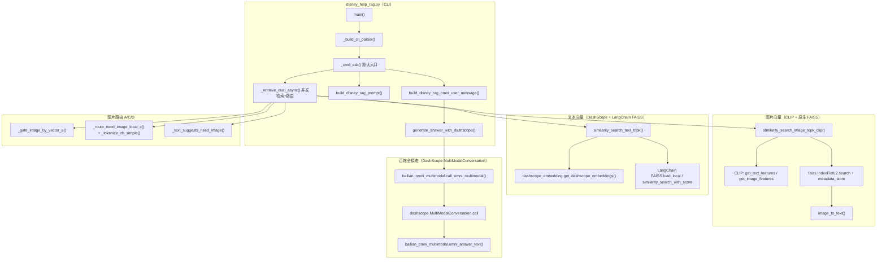
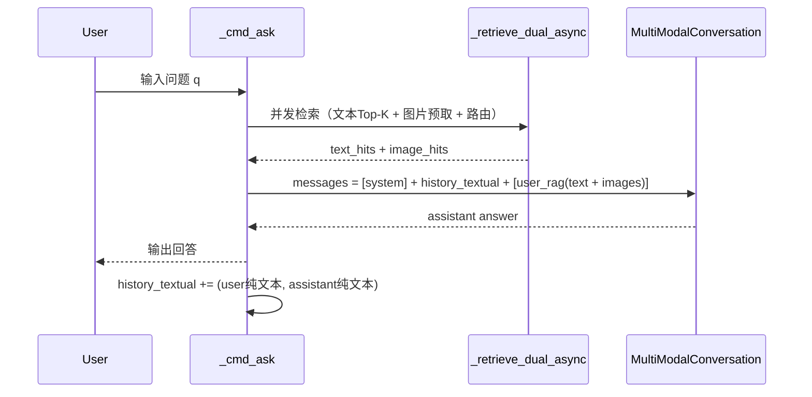
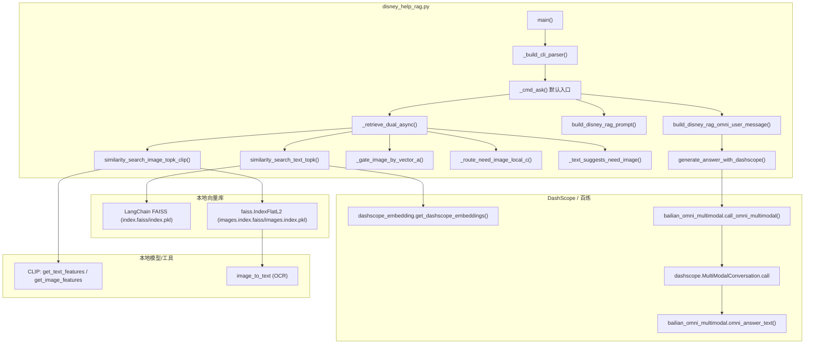

# 2026-04-08 学习日记：Disney 双路 RAG（文本 + 图片）与百炼全模态对话

> 题外话：最近身体不太舒服，之前一直硬扛着，后来去医院检查后发现必须调整生活方式，于是踏实休息了一阵。现在状态已经稳定下来，继续恢复学习节奏。也希望大家都多注意身体，不舒服千万别硬抗，及时检查、及时休息。

> 项目位置：`data/课程练习/RAG技术与应用/disney_help_rag.py`  
> 目标：把“迪士尼知识库”做成可运行的 **双索引 RAG**（文本向量 + 图片向量），并在交互模式下默认接入 **百炼全模态大模型**（`MultiModalConversation`）。

---

## 一、今天做了什么（成果清单）

- **双路检索**：同一问题同时跑：
  - **文本 Top-K**：DashScope embedding（`text-embedding-v1`）→ LangChain FAISS（L2）；
  - **图片 Top-K**：CLIP 文本侧向量 → 本地 FAISS `IndexFlatL2`（L2）；
  - 输出统一结构：`rank / l2_distance / metadata`，便于后续拼 prompt 与路由。
- **图片检索路由（A + C + D）**：不靠大模型、仅用启发式决定“是否需要图片”：
  - **A（向量 gate）**：先对图片做小 k 预取，用 top1 距离/间隔阈值决定是否拉全量 Top-K；
  - **C（本地 OCR overlap）**：中文粗分词 + 2-gram + overlap 得分，判断 query 是否与 OCR 高相关；
  - **D（文本 cue）**：文本召回内容/文件名中出现“地图/海报/二维码”等提示词则触发图片。
- **Prompt 构建**：`build_disney_rag_prompt` 把文本 chunk 与图片（OCR + path）统一整理为结构化背景，且做 **max_context_chars 截断**。
- **默认进入“正常对话流程”**：`python disney_help_rag.py` 无子命令时进入 `ask`，并 **默认 `use_llm=True`**，即：每轮先检索、再调用百炼全模态生成回答；可用 `--no-use-llm` 只检索。
- **全模态输入形态**：用 `MultiModalConversation` 的 `messages[].content = [{"text":...}, {"image":...}, ...]` 传入：
  - 本轮 RAG 文本（一个大 `text` 块）
  - 本轮检索到的图片（可解析为本地文件路径或 URL 时追加为 `image` 块）
- **交互多轮对话**：会话内保留历史轮次的 **纯文本**（用户原话 + 助手回答），避免把历史图片反复塞进上下文导致体积失控。

---

## 二、模块与关键技术点（按层拆解）

### 1）数据层（Word / 图片）

- **Word → Markdown → chunks_json**
  - 由 `doc_file_utils` 提供：`export_doc_and_docx_to_markdown`、`export_parsed_markdown_chunks_for_doc_paths`、`chunks_json_dir_to_faiss_chunks`。
  - 每个 chunk 都带 metadata（如 `source_file / chunk_id / department / update_time`）。
- **图片 → OCR + CLIP 向量**
  - OCR：`image_file_utils.image_to_text`（Tesseract 风格）。
  - 图片向量：CLIP（`openai/clip-vit-base-patch32`）提取 **512 维**视觉投影向量。
  - 图片 metadata：额外增加 `ocr_text` 与 `path_raw`（后续给全模态模型附图/定位用）。

### 2）向量化层（双索引）

- **文本向量库**
  - 模型：DashScope embedding（当前在脚本中默认 `text-embedding-v1`）。
  - 存储：LangChain `FAISS.save_local` 产物（`index.faiss + index.pkl`）。
  - 检索：`FAISS.similarity_search_with_score` 返回 `(Document, L2 distance)`。
- **图片向量库**
  - 向量空间：CLIP 文本↔图同空间。
  - 索引：原生 `faiss.IndexFlatL2(dim)`，落盘 `images.index.faiss + images.index.pkl`。
  - 检索：`index.search(query_vec, k)` → `l2_distance` + `metadata_store[idx]` 映射。

### 3）检索层（并发 + 路由）

- **并发执行**：`_retrieve_dual_async` 使用 `asyncio.gather` + `asyncio.to_thread` 并发：
  - 文本检索（需要 embedding API Key 时才执行）
  - 图片预取（小 k）用于 gate（A）
- **路由策略**：
  - A（向量 gate）：`_gate_image_by_vector_a`
  - C（OCR overlap）：`_route_need_image_local_c` + `_tokenize_zh_simple`
  - D（文本 cue）：`_text_suggests_need_image`
- **工程点**：把“可能很慢/阻塞”的工作统一包进 `to_thread`，避免主线程卡住交互。

### 4）生成层（百炼全模态对话）

- **调用方式**：`bailian_omni_multimodal.call_omni_multimodal` → `dashscope.MultiModalConversation.call`
- **模型选择优先级**：
  - CLI `--chat-model`
  - 环境变量 `DASHSCOPE_OMNI_MODEL` / `DASHSCOPE_CHAT_MODEL`
  - 默认 `DEFAULT_OMNI_MODEL = "qwen3.5-omni-plus-2026-03-15"`
- **输入组织**：
  - `build_disney_rag_omni_user_message`：只生成本轮 `user`（含 RAG 文本 + 附图）
  - `ask` 交互：`[system] + history_textual + [user_rag]`
- **输出解析**：`omni_answer_text` 优先从 `output.choices[0].message.content`（字符串或多块）提取文本。

---

## 三、踩过的坑（问题 → 根因 → 修复点）

### 1）CLIP `get_image_features` 返回结构变化导致向量 shape 错

- **现象**：图片向量堆叠时报 `ndim!=1` 或出现 `(seq, hidden)` 这类 2D/3D shape。
- **根因**：新版 `transformers` 里 `get_image_features()` 可能返回 `BaseModelOutputWithPooling`，直接 `out[0]` 会取到 `last_hidden_state`，不是最终投影向量。
- **修复**：兼容两类返回：
  - 若是 `torch.Tensor` 直接用；
  - 否则优先 `pooler_output`，没有则手动取 `last_hidden_state[:,0,:]` 再过投影层。

### 2）macOS OpenMP 冲突导致 abort

- **现象**：FAISS / NumPy / PyTorch 混用时，macOS 偶发 OpenMP 冲突退出。
- **处理**：Darwin 下设置 `KMP_DUPLICATE_LIB_OK=TRUE`（工程上是折中方案，确保练习可跑）。

### 3）百炼全模态 403 Access denied

- **现象**：`status_code=403`，message 包含 `Access denied`。
- **根因**：API Key / Workspace 没有该模型（如 `qwen3.5-omni-plus-2026-03-15`）调用权限。
- **改进**：
  - `omni_answer_text` 报错时附带 `code` 字段并给出排查/替代建议；
  - 交互流程捕获异常，不再让进程直接崩溃，可提示使用 `--chat-model qwen-vl-plus` 或 `--no-use-llm`。
  - 有些免费模型虽然有额度，但还是需要单独申请，

---

## 四、可复现命令（推荐）

- **默认交互（检索 + 全模态回答）**

```bash
python disney_help_rag.py
```

- **只检索（不调用大模型）**

```bash
python disney_help_rag.py ask --no-use-llm
```

- **打印 prompt 以便调试（仍可同时对话）**

```bash
python disney_help_rag.py ask --print-prompt
```

- **切换全模态模型**

```bash
python disney_help_rag.py ask --chat-model qwen-vl-plus
```

---

## 五、给同事看的调用图（Mermaid）

### 5.1 总览：CLI → 检索 → 全模态生成



### 5.2 Ask 交互（多轮）的消息组织



---

## 六、补充：`disney_help_rag.py`（双路检索 + 全模态对话）调用关系图

> 适用：`data/课程练习/RAG技术与应用/disney_help_rag.py`  
> 特点：**文本向量（DashScope embedding + LangChain FAISS）** 与 **图片向量（CLIP + 原生 FAISS）** 两套索引；`ask` 默认进入 **百炼全模态对话**（`MultiModalConversation`）。



## 七、相关代码（GitHub）

课程练习 **RAG技术与应用** 目录（含 `disney_help_rag.py` 等）：  
[Cyning12/auto-gpt-work-demo · `data/课程练习/RAG技术与应用`](https://github.com/Cyning12/auto-gpt-work-demo/tree/main/data/%E8%AF%BE%E7%A8%8B%E7%BB%83%E4%B9%A0/RAG%E6%8A%80%E6%9C%AF%E4%B8%8E%E5%BA%94%E7%94%A8)
