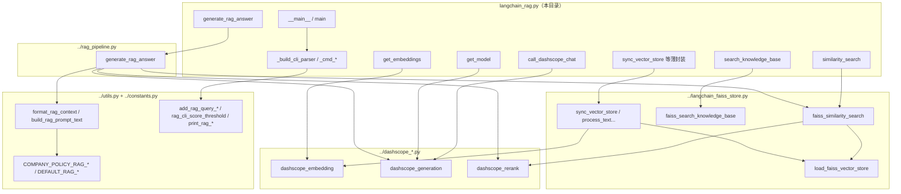
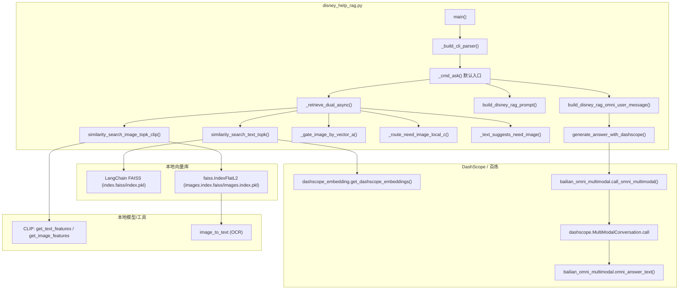
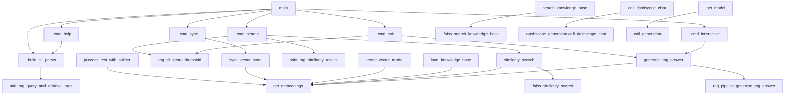
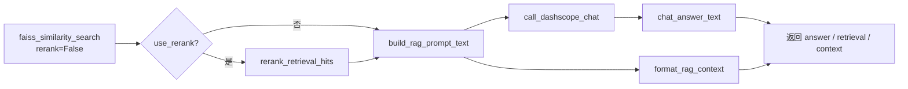

# `langchain_rag.py` 使用流程与调用关系（重构后）

`langchain_rag.py` 现为**练习入口 + 薄封装**：默认路径、API Key、`get_embeddings()` 注入到 `../langchain_faiss_store.py`、`../rag_pipeline.py` 等模块。下列路径均相对于本文件所在目录的上一级 **`data/课程练习/`**。

---

## 一、`data/课程练习/` 模块分工

| 模块 | 职责 |
|------|------|
| **`constants.py`** | 制度 RAG 用 `COMPANY_POLICY_RAG_SYSTEM_TEMPLATE`、`DEFAULT_RAG_TOP_K`、`DEFAULT_RAG_SIMILARITY_THRESHOLD`（与 CO-STAR 用的 `PROFESSIONAL_SYSTEM_TEMPLATE` 并存） |
| **`utils.py`** | `format_rag_context`、`build_rag_prompt_text`；CLI 辅助 `add_rag_query_and_retrieval_args`、`rag_cli_score_threshold`、`print_rag_similarity_results`；`generation_first_message` 等 |
| **`dashscope_embedding.py`** | `get_dashscope_embeddings`、`call_text_embedding`、`log_embedding_failure_hint`、`DashScopeEmbeddingsSafe` |
| **`dashscope_generation.py`** | `call_generation`、`call_dashscope_chat`、`chat_answer_text` |
| **`dashscope_rerank.py`** | `call_text_rerank`、`rerank_retrieval_hits`、`DEFAULT_RERANK_MODEL` |
| **`langchain_faiss_store.py`** | PDF 分块、建库、增量同步、`load_faiss_vector_store`、`faiss_l2_distance_to_similarity`、`faiss_similarity_search`、`faiss_search_knowledge_base` |
| **`rag_pipeline.py`** | **`generate_rag_answer`**：检索 → 精排 → 拼 prompt → 对话（无 Function Calling） |
| **`langchain_rag.py`**（本目录） | `sys.path`、`.env`、`_FILES_PATH` / `_VECTOR_MODEL_PATH`、CLI、`similarity_search` / `generate_rag_answer` 等对上述模块的薄封装 |

---

## 二、使用流程（按场景）

### 1. 入口

- `python langchain_rag.py`：`__main__` → `_setup_cli_logging()` → `main()`。
- `main()`：若解析到子命令则执行对应 `handler`；**无子命令** → `_cmd_interactive()`。

### 2. 子命令与数据流

| 场景 | 调用链（摘要） |
|------|----------------|
| **sync** | `_cmd_sync` → `sync_vector_store` → `langchain_faiss_store.sync_vector_store`（PDF、嵌入、FAISS） |
| **search** | `_cmd_search` → `similarity_search` → `faiss_similarity_search`（可选 `rerank`）→ `utils.print_rag_similarity_results` |
| **ask** | `_cmd_ask` → `generate_rag_answer`（本文件）→ **`rag_pipeline.generate_rag_answer`** |
| **help** | `_cmd_help` → `_build_cli_parser` / `print_help` |
| **默认交互** | `_cmd_interactive` → 循环 `generate_rag_answer` |

### 3. RAG 生成路径（`rag_pipeline.generate_rag_answer`）

**仍非 Function Calling**，固定顺序为：

1. **`faiss_similarity_search`**（`rerank=False`；内部可 `load_faiss_vector_store` + `FAISS.similarity_search_with_score` + `faiss_l2_distance_to_similarity`）
2. 若 `use_rerank`：**`rerank_retrieval_hits`** → **`call_text_rerank`**（DashScope `TextReRank`）
3. **`build_rag_prompt_text`** → **`format_rag_context`**（模板来自 **`constants.COMPANY_POLICY_RAG_SYSTEM_TEMPLATE`**）
4. **`call_dashscope_chat`** → **`call_generation`**
5. **`chat_answer_text`** →（内部）`utils.generation_first_message`

本练习脚本里的 `langchain_rag.generate_rag_answer` 只做参数绑定（`get_embeddings()`、`_api_key`、`_VECTOR_MODEL_PATH` 等），再调用 `rag_pipeline.generate_rag_answer`。

### 4. 仅检索路径（`similarity_search`）

- `langchain_rag.similarity_search` → **`faiss_similarity_search`**（传入 `embeddings`/`save_dir` 或已有 `vector_db`）。
- 若 `rerank=True`，精排在 **`faiss_similarity_search` 内部** 通过 **`rerank_retrieval_hits`** 完成（与 `rag_pipeline` 里「检索后第二次精排」是同一套 rerank 工具，但调用场景不同）。

---

## 三、分层调用关系图（Mermaid）

### 3.1 总览：从 `langchain_rag` 到各包

### 3.2 `langchain_rag.py` 内部：函数谁调谁

---

## 四、补充：`disney_help_rag.py`（双路检索 + 全模态对话）调用关系图

> 适用：`data/课程练习/RAG技术与应用/disney_help_rag.py`  
> 特点：**文本向量（DashScope embedding + LangChain FAISS）** 与 **图片向量（CLIP + 原生 FAISS）** 两套索引；`ask` 默认进入 **百炼全模态对话**（`MultiModalConversation`）。

（不含各函数体里的跨文件实现，只画**本文件**内的箭头。）

说明：`rag_cli_score_threshold`、`print_rag_similarity_results`、`add_rag_query_and_retrieval_args` 定义在 **`utils`**；`faiss_similarity_search`、`faiss_search_knowledge_base` 定义在 **`langchain_faiss_store`**。

### 3.3 `rag_pipeline.generate_rag_answer` 内部

---

## 四、兼容与孤立符号

- **`_DEFAULT_TOP_K` / `_DEFAULT_SIMILARITY_THRESHOLD`**：分别别名到 `constants` 的 `DEFAULT_RAG_TOP_K`、`DEFAULT_RAG_SIMILARITY_THRESHOLD`，供旧笔记引用。
- **`search_knowledge_base`**：仓库内仍可能无调用方；语义上等于已加载 `vector_db` 的 `faiss_search_knowledge_base`（经本脚本传入 `_api_key` 精排）。
- **`get_model`**：兼容旧练习签名，本文件内无其它函数调用。
- **`call_dashscope_chat`（本文件）**：对 `dashscope_generation.call_dashscope_chat` 注入 `CHAT_MODEL` 与 `_api_key`；**`rag_pipeline` 不经过此包装**，直接调 generation 模块。

---

## 五、文件位置

| 说明 | 路径 |
|------|------|
| 本文档 | `RAG技术与应用/langchain_rag_调用关系图.md` |
| 练习入口脚本 | `RAG技术与应用/langchain_rag.py` |
| 可复用逻辑 | `../constants.py`、`../utils.py`、`../langchain_faiss_store.py`、`../dashscope_*.py`、`../rag_pipeline.py` |

在 VS Code / Cursor / GitHub 中打开本文件即可预览 Mermaid；亦可复制代码块到 [mermaid.live](https://mermaid.live) 导出图。
